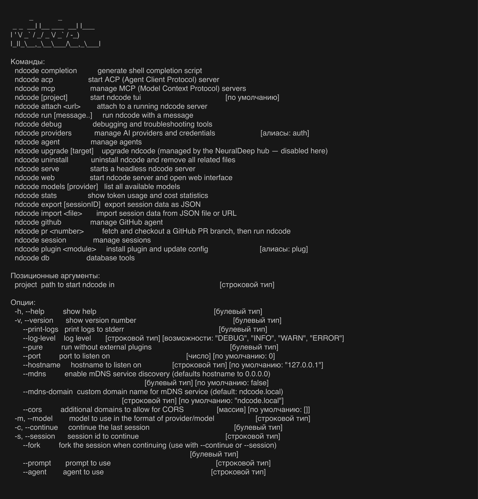
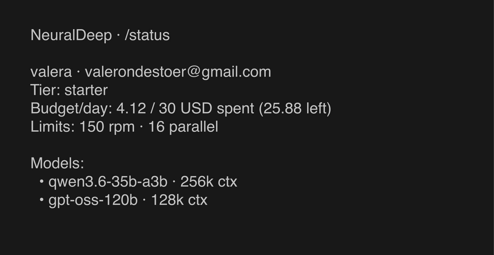

# NeuralDeepCode (`ndcode`)

**Terminal AI coding agent for the [NeuralDeep](https://neuraldeep.ru) hub.**

`ndcode` is a terminal coding agent (a rebranded, hub-integrated fork of
[opencode](https://github.com/sst/opencode), MIT). It talks to the self-hosted
NeuralDeep LLM hub — RU-hosted Qwen3 / gpt-oss models on your own GPUs — and adds
two native slash commands so you log in with your browser and see your tier and
budget right inside the TUI.

<p align="center">
  
</p>

## Hub integration

| command | what it does |
|---|---|
| **`/login`** | Browser SSO (localhost-callback, like `gh auth login`). Opens `hub.neuraldeep.ru`, mints your per-user key, stores it, and auto-configures the `neuraldeep` provider. |
| **`/status`** | Shows your tier, daily budget (spent / limit / remaining), rate limits, and available models — straight from the hub. |

Once logged in, the `neuraldeep` provider (pointing at `https://api.neuraldeep.ru/v1`)
is ready with the hub's coding models:

- **`qwen3.6-35b-a3b`** — MoE, native tool-calling, 256k ctx
- **`gpt-oss-120b`** — reasoning, 131k ctx

Tier, rate limits, daily budget and model access are enforced by the hub gateway —
`ndcode` just consumes and displays them. See the hub contract:
[cli-integration-guide](https://hub.neuraldeep.ru) (`docs/services/api/cli-integration-guide.md`).

<p align="center">
  
</p>

## Install (one-liner)

```bash
curl -fsSL https://raw.githubusercontent.com/vakovalskii/NeuralDeepCode/main/install.sh | sh
```

Installs the prebuilt single binary to `~/.local/bin/ndcode` (no Bun/Node needed
at runtime). Then:

```bash
ndcode                 # launch the TUI
/login                 # browser SSO → key stored, provider configured
/status                # tier / budget / models
/models                # pick neuraldeep/qwen3.6-35b-a3b or gpt-oss-120b
```

## Run from source (for development)

```bash
git clone https://github.com/vakovalskii/NeuralDeepCode && cd NeuralDeepCode
bun install            # Bun >= 1.3.14
bun run dev            # launches the ndcode TUI

# build a standalone binary for your platform:
bun run --cwd packages/ndcode script/build.ts --single --skip-embed-web-ui
# → packages/ndcode/dist/ndcode-<os>-<arch>/bin/ndcode
```

Config lives in `~/.config/ndcode/` (`ndcode.json`, `neuraldeep.key`). Environment
variables are prefixed `NDC_`; override hub endpoints with `NEURALDEEP_HUB` and
`NEURALDEEP_API_BASE`.

## Headless / non-interactive

`ndcode` runs without the TUI — for scripts, CI, pipes, and editor/agent
integrations. Authenticate once interactively (`ndcode` → `/login`); the stored
hub credential is reused by all headless commands.

**One-shot run** — send a prompt, print the result, exit:

```bash
ndcode run "explain what this repo does"
ndcode run --model neuraldeep/qwen3.6-35b-a3b "add a healthcheck endpoint"

# machine-readable stream of events (for tooling / CI):
ndcode run --format json "list the TODOs in this codebase"

# pipe a prompt in:
echo "summarize the diff" | ndcode run

# continue / resume a session:
ndcode run --continue "now write tests for it"
ndcode run --session <id> "..."
```

Useful `run` flags: `--model provider/model`, `--agent <name>`, `--format default|json`,
`--file <path>` (attach files), `--continue` / `--session <id>`, `--share`,
`--attach <url>` (drive a running server).

**Headless server** — long-running HTTP API (drive it from editors, the SDK, or
`ndcode attach`):

```bash
ndcode serve --port 4096 --hostname 127.0.0.1
# from another shell / machine:
ndcode attach http://127.0.0.1:4096
ndcode run --attach http://127.0.0.1:4096 "..."   # auth: --password / NDC_SERVER_PASSWORD
```

**ACP server** — Agent Client Protocol over stdio, for IDE/editor integrations:

```bash
ndcode acp
```

All headless modes use the same `neuraldeep` provider and hub budget/limits as the TUI.

## What's different from opencode

- Rebranded to `ndcode` / **NeuralDeepCode** (command, config dir `~/.config/ndcode`, `NDC_` env, logo).
- Native **`/login`** + **`/status`** hub commands and a default `neuraldeep` provider.
- Stripped of opencode's SaaS/marketing/desktop packages.
- **Auto-update disabled** — `ndcode` is distributed via the NeuralDeep hub, never self-updates from upstream opencode.
- No telemetry by default; nothing is sent to opencode.ai.

## Contributors

- **Valerii Kovalskii** ([@vakovalskii](https://github.com/vakovalskii)) — maintainer, NeuralDeep hub integration (`/login`, `/status`, `neuraldeep` provider), rebrand.

Contributions welcome — open an issue or PR.

## Credits / license

NeuralDeepCode is a fork of **[sst/opencode](https://github.com/sst/opencode)**,
licensed under the **MIT License**. The upstream copyright notice is retained in
[`LICENSE`](LICENSE), as the license requires. This fork is likewise MIT.

Upstream is tracked as the `upstream` git remote for pulling future improvements.
